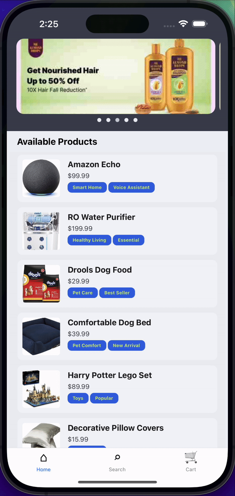

# Neon Ecommerce

## Overview
Neon Ecommerce is a React Native e-commerce application that provides a seamless shopping experience for users. The app features a wide range of products, a shopping cart, and a streamlined checkout process. It is designed with a clean and modern interface, ensuring ease of use on both Android and iOS devices.

### DEMO:
&nbsp;&nbsp;&nbsp;&nbsp; 
| Android Demo | iOS Demo |
|--------------|----------|
|  |  |

## Features
- **Home Screen**: Displays a carousel of discount images and a list of available products.
- **Search Functionality**: Users can search for products, with results displayed in real-time.
- **Product Details**: Detailed view of each product, with options to adjust quantity and add to cart.
- **Cart Management**: View cart items, adjust quantities, and proceed to checkout.
- **Checkout Process**: Review cart items and place orders.
- **Order Confirmation**: Displays a summary of the order after successful placement.

## Instructions to Run

This project was bootstrapped with [React Native CLI](https://reactnative.dev/docs/environment-setup).

### Step 1: Install Dependencies
In the project directory, run:

```bash
npm install
```

### Step 2: Start the Metro Server

To start Metro, run the following command from the root of your React Native project:

```bash
npm start
```

### Step 3: Start your Application

Let Metro Bundler run in its own terminal. Open a new terminal from the root of your React Native project. Run the following command to start your Android or iOS app:

#### For Android

```bash
npm run android
```

#### For iOS

```bash
npm run ios
```

If everything is set up correctly, you should see your new app running in your Android Emulator or iOS Simulator shortly, provided you have set up your emulator/simulator correctly.

## Screens
| Screen           | Functionality                                           |
|------------------|-------------------------------------------------------|
| Home Screen      | Displays products and carousel.                       |
| Search Screen    | Allows users to search for products.                  |
| Product Details   | Shows product details and allows adding to cart.      |
| Cart Screen      | Displays items in the cart and allows checking out.   |
| Cart Review Screen| Shows order summary and payment method.               |
| Confirmation Screen| Displays order confirmation details.                  |

## Troubleshooting

If you encounter issues running the app, please refer to the following resources:

- [React Native Environment Setup](https://reactnative.dev/docs/environment-setup)
- [React Native Troubleshooting](https://reactnative.dev/docs/troubleshooting)

## Learn More

To learn more about React Native, take a look at the following resources:

- [React Native Website](https://reactnative.dev)
- [Getting Started with React Native](https://reactnative.dev/docs/getting-started)

## Note
This application does not include user authentication features.
```

Feel free to modify any sections as needed or add additional information before finalizing it in your README file!
